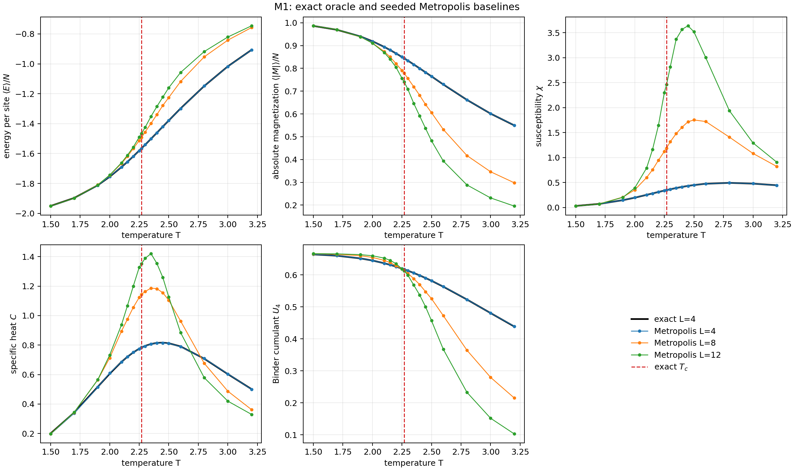
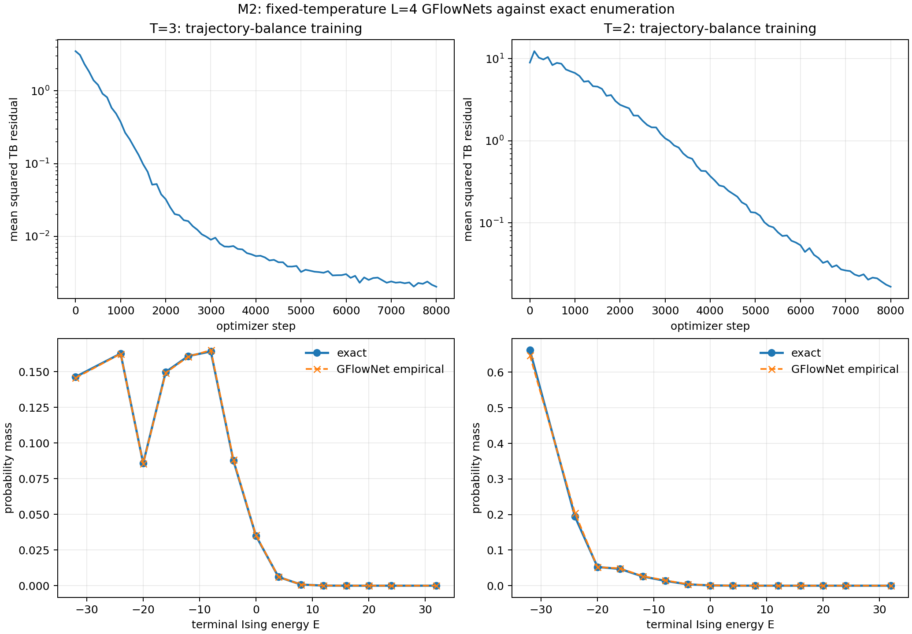
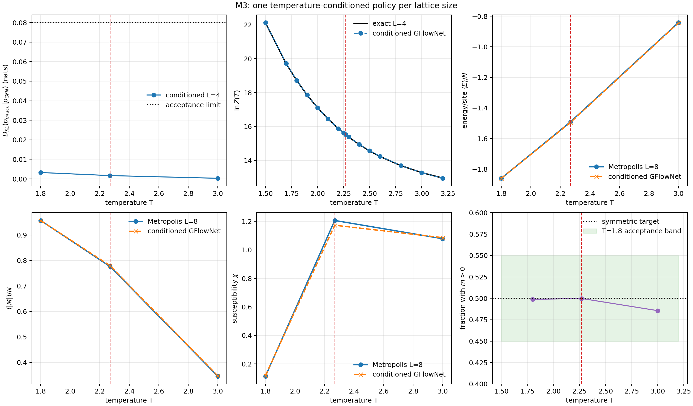
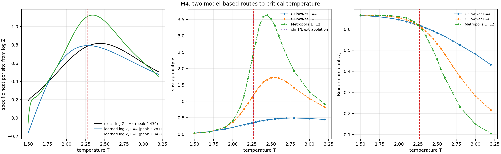
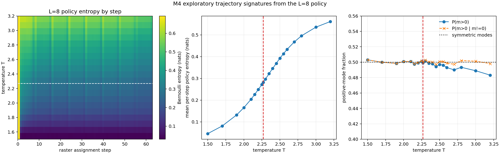

# Learning Criticality with a Temperature-Conditioned GFlowNet

## Abstract

This project asks whether a generative flow network (GFlowNet) can learn the
Boltzmann distribution of the two-dimensional square-lattice Ising model and
then reveal its critical temperature from the learned model itself. The work is
deliberately restricted to a single Mac CPU and small lattices. Exact enumeration
of all 65,536 states at L=4 provides an oracle; seeded Metropolis-Hastings chains
at L=4, 8, and 12 provide an independent baseline. Fixed-temperature L=4 models
reach empirical \(D_{KL}(p_{\rm exact}\Vert p_{\rm GFN})\) below 0.016 nats at
T=2 and T=3. A single inverse-temperature-conditioned model then reaches exact
L=4 KL below 0.0033 nats and reproduces L=8 energy, absolute magnetization, and
susceptibility within 0.45%, 0.45%, and 4.35% of Metropolis, respectively. Two
routes predict criticality. Curvature of the L=8 model's learned \(\ln Z\) gives
\(T_c=2.3422\); finite-size susceptibility extrapolation gives 2.2735, Binder
crossings average to 2.2462, and their equal-route observable consensus is
\(T_c=2.2599\). The exact thermodynamic-limit value is 2.2692. These results show
that a small trajectory-balance model can learn both samples and normalization,
but they also expose derivative sensitivity, finite-size bias, and places where
conventional MCMC remains the stronger tool. All abstract numbers come from the
[M2](results/m2_metrics_20260818T012603-0400.json),
[M3](results/m3_metrics_20260818T015650-0400.json), and
[M4](results/m4_metrics_20260818T021212-0400.json) validation records.

## 1. Problem statement

The zero-field Ising model is simple to state but difficult to sample near its
phase transition. Below the transition, two ordered modes compete; near the
transition, long correlations slow local Markov chains; and the partition
function is generally intractable. A GFlowNet is attractive because it is
trained to assign terminal probability proportional to a nonnegative reward and
learns a normalization constant as part of trajectory balance
[Bengio et al. (2021)](#references). Here the reward is the unnormalized
Boltzmann weight.

The research questions are:

1. Can a CPU-sized GFlowNet reproduce an exactly known L=4 Boltzmann
   distribution at fixed and varying temperature?
2. Can one conditioned model cover both ordered magnetization modes and match an
   independent L=8 Metropolis baseline?
3. Can critical temperature be predicted in two independent ways: from learned
   \(\ln Z(T)\) and from observables of generated configurations?

The exact thermodynamic-limit result,

\[
T_c=\frac{2}{\ln(1+\sqrt 2)}=2.269185\ldots,
\]

is used only as a reference line and final comparison, not as a training target
[Onsager (1944)](#references).

## 2. Ising and Boltzmann background

For spins \(s_i\in\{-1,+1\}\), nearest-neighbor coupling \(J=1\), periodic
boundaries, and zero field, the Hamiltonian is

\[
E(x)=-\sum_{\langle i,j\rangle}s_i s_j.
\]

The code counts each bond once using the right and lower neighbor of every site.
At temperature \(T\), with \(\beta=1/T\),

\[
p_T(x)=\frac{e^{-\beta E(x)}}{Z(T)},\qquad
Z(T)=\sum_x e^{-\beta E(x)}.
\]

Writing \(N=L^2\) and \(M=\sum_i s_i\), the measured observables are

\[
u=\frac{\langle E\rangle}{N},\qquad
|m|=\frac{\langle|M|\rangle}{N},
\]

\[
\chi=\frac{\beta}{N}\left(\langle M^2\rangle-\langle|M|\rangle^2\right),
\qquad
c=\frac{\beta^2}{N}\left(\langle E^2\rangle-\langle E\rangle^2\right),
\]

\[
U_4=1-\frac{\langle M^4\rangle}{3\langle M^2\rangle^2}.
\]

The connected absolute-magnetization convention for \(\chi\) removes the
artificial variance caused by a finite system tunneling between symmetry-related
signs. Peaks of \(\chi\) and \(c\), together with crossings of \(U_4\), provide
finite-size signatures of criticality.

## 3. GFlowNet formulation

### 3.1 State and action space

The source state is an unassigned lattice. At raster step \(t\), the policy
assigns site \(t\) to \(-1\) or \(+1\). A terminal configuration is reached after
\(N\) actions and receives reward

\[
R_T(x)=e^{-E(x)/T}.
\]

Raster order gives each terminal exactly one trajectory and each non-source
state one parent. The backward probability is therefore one.

### 3.2 Trajectory balance and learned normalization

For a general trajectory \(\tau\) ending at \(x\), trajectory balance requires
[Malkin et al. (2022)](#references)

\[
Z\prod_tP_F(s_{t+1}\mid s_t)
=R(x)\prod_tP_B(s_t\mid s_{t+1}).
\]

In this unique-path construction, the log residual is

\[
\delta(x,T)=\log Z(T)+\sum_t\log P_F(s_{t+1}\mid s_t,T)+\frac{E(x)}{T},
\]

and training minimizes \(\mathbb E[\delta^2]\). If the residual vanishes,
normalization of the autoregressive policy forces
\(P_F(x\mid T)=R_T(x)/Z(T)\). Thus the learned \(\log Z\) has a direct
thermodynamic interpretation. This use of GFlowNets as normalized discrete
probabilistic models follows the broader formulation studied by
[Zhang et al. (2022)](#references).

### 3.3 Conditioned architecture and mode symmetry

The fixed-T L=4 model uses two 128-unit hidden layers. The conditioned models
use inverse temperature as an input and a separate small network for
\(\log Z_\theta(\beta)\). A masked autoregressive MLP evaluates every raster
conditional in one training pass while mathematically blocking current and
future spins. The L=8 model uses two 256-unit hidden layers, the project CPU
ceiling. Inputs include \(s_i\) and \(\beta s_i\), with a causal skip path for
local temperature-scaled interactions.

Zero-field spin-flip symmetry is imposed by antisymmetrizing each policy logit,

\[
\ell(s_{<t},\beta)=\tfrac12[g(s_{<t},\beta)-g(-s_{<t},\beta)].
\]

This guarantees \(P_F(x\mid\beta)=P_F(-x\mid\beta)\) without using validation
samples. Training batches mix uniform, current-policy, noisy ordered, and block
domain configurations; every configuration is paired with its global spin
flip. Full architecture and training parameters are recorded in
[M2](results/m2_metrics_20260818T012603-0400.json) and
[M3](results/m3_metrics_20260818T015650-0400.json).

## 4. Validation methodology

### 4.1 Exact L=4 oracle

All \(2^{16}=65{,}536\) L=4 configurations are enumerated. Stable log-sum-exp
evaluation gives exact probabilities, \(\ln Z\), and observables at every
temperature. Unit tests check aligned and checkerboard energies, single-spin
energy changes, wrapped bonds, enumeration count, ground-state degeneracy,
normalization, seeded reproducibility, autoregressive causality, spin symmetry,
and numerical critical estimators. The final suite contains 20 passing tests
[M4 metrics](results/m4_metrics_20260818T021212-0400.json).

### 4.2 Independent Metropolis baseline

Metropolis-Hastings proposes every site once per checkerboard sweep and accepts
an energy increase \(\Delta E\) with probability \(e^{-\Delta E/T}\). Independent
chains use mixed random/ordered starts, explicit burn-in, thinning, and explicit
seeds. M1 validates L=4 MCMC directly against exact enumeration before any
GFlowNet comparison. The largest lattice used anywhere is L=12, and it is used
only for MCMC as required.

### 4.3 Reproducibility and acceptance gates

Every validator writes a timestamped JSON record containing seeds, Git revision,
hyperparameters, measured criteria, artifact paths, and model hashes. No
acceptance tolerance was changed after a run. The complete progression is
append-only in [PROGRESS.md](PROGRESS.md), and derivations are in
[NOTES.md](NOTES.md).

## 5. Results

### 5.1 Exact physics and MCMC

Across an 18-temperature grid, the worst L=4 MCMC errors remained far inside the
required gates:

| Observable | Maximum relative error | Required | Source |
|---|---:|---:|---|
| Energy per site | 0.1003% | 1% | [M1 JSON](results/m1_metrics_20260818T002648-0400.json) |
| \(|m|\) | 0.1019% | 1% | [M1 JSON](results/m1_metrics_20260818T002648-0400.json) |
| Susceptibility | 2.7492% | 5% | [M1 JSON](results/m1_metrics_20260818T002648-0400.json) |
| Specific heat | 1.2070% | 5% | [M1 JSON](results/m1_metrics_20260818T002648-0400.json) |

The L=12 susceptibility maximum on that grid occurred at T=2.45, inside the
required [2.15, 2.45] interval
[M1 JSON](results/m1_metrics_20260818T002648-0400.json).

### 5.2 Fixed-temperature GFlowNets

Each empirical distribution below uses two million seeded terminal draws and a
disclosed Jeffreys half-count for bins absent from the finite histogram. The
unsmoothed model KL is also shown.

| T | Empirical KL (nats) | Exact model KL | Energy error | \(|m|\) error | \(\ln Z\) error | Source |
|---:|---:|---:|---:|---:|---:|---|
| 3.0 | 0.014762 | 0.000511 | 0.2222% | 0.1711% | 0.0055% | [M2 JSON](results/m2_metrics_20260818T012603-0400.json) |
| 2.0 | 0.015377 | 0.002200 | 0.6169% | 0.3366% | 0.5473% | [M2 JSON](results/m2_metrics_20260818T012603-0400.json) |

### 5.3 One model across temperature

The single L=4 conditioned model reaches exact KL 0.003255 at T=1.8, 0.001690 at
T=2.269185, and 0.000308 at T=3.0. Its worst \(\ln Z(T)\) error over a 16-point
grid is 0.1053% [M3 JSON](results/m3_metrics_20260818T015650-0400.json).

For L=8, each comparison uses 200,000 GFlowNet terminals and 256,000 fresh
Metropolis samples:

| T | Energy error | \(|m|\) error | \(\chi\) error | \(P(m>0)\) | Source |
|---:|---:|---:|---:|---:|---|
| 1.8 | 0.0034% | 0.0281% | 4.3499% | 0.498825 | [M3 JSON](results/m3_metrics_20260818T015650-0400.json) |
| 2.269185 | 0.2359% | 0.4480% | 2.7736% | 0.499845 | [M3 JSON](results/m3_metrics_20260818T015650-0400.json) |
| 3.0 | 0.2462% | 0.3822% | 0.6978% | 0.485640 | [M3 JSON](results/m3_metrics_20260818T015650-0400.json) |

The raw positive fraction drops slightly at high T because configurations with
exactly zero magnetization become more common; conditional on \(m\ne0\), the
two signs remain balanced.

### 5.4 Critical temperature from learned \(\ln Z\)

Thermodynamic identities give

\[
U=-\frac{\partial\ln Z}{\partial\beta},\qquad
c=\frac{\beta^2}{N}\frac{\partial^2\ln Z}{\partial\beta^2}.
\]

M4 samples \(\ln Z\) on 256 beta points, fits a degree-10 Chebyshev smoother,
and differentiates the fit. Applied to exact L=4 \(\ln Z\), this pipeline finds
T=2.439257 versus the direct exact finite-size peak T=2.438950, a 0.0126% error.
Applied unchanged to learned \(\ln Z\), it predicts T=2.281360 at L=4 and
T=2.342234 at L=8. The larger-size value is the primary logZ-route prediction:

\[
\boxed{T_c^{(\log Z)}=2.3422}
\]

It is 3.22% above the exact thermodynamic-limit Tc and lies inside the required
[2.1, 2.5] finite-size window
[M4 JSON](results/m4_metrics_20260818T021212-0400.json).

### 5.5 Critical temperature from generated observables

Local quadratic fits give susceptibility peaks at T=2.812028 (L=4 GFlowNet),
2.552567 (L=8 GFlowNet), and 2.447225 (L=12 Metropolis). Fitting
\(T_\chi(L)=T_c+a/L\) gives

\[
T_c^{(\chi)}=2.273526,\qquad R^2=0.99825.
\]

Binder crossings are T=2.242534 for L4/L8 and T=2.249908 for L8/L12; their mean
is 2.246221. Giving the susceptibility family and mean Binder family equal
weight defines the declared observable consensus:

\[
\boxed{T_c^{(\mathrm{obs})}=2.2599}.
\]

This consensus is 0.41% below exact Tc; the susceptibility extrapolation alone
is 0.19% above it. The equal weighting is a transparent reporting convention,
not a post-hoc fitted parameter
[M4 JSON](results/m4_metrics_20260818T021212-0400.json).

### 5.6 Exploratory trajectory signatures

The mean L=8 Bernoulli action entropy rises from 0.04587 nats at T=1.5 through
0.28136 at exact Tc to 0.56129 at T=3.2. At exact Tc,
\(P(m>0\mid m\ne0)=0.50014\). Entropy changes smoothly rather than defining an
additional sharp estimator, so no third Tc claim is made
[M4 JSON](results/m4_metrics_20260818T021212-0400.json).

## 6. Discussion and limitations

The strongest result is not merely that generated means are close to a baseline.
Trajectory balance learns a normalized distribution and a temperature-dependent
partition function, enabling a Tc estimate from model curvature without terminal
sampling. The independent observable route then lands close to Onsager's value
using generated L=4/L=8 states plus an L=12 MCMC anchor.

Several limitations matter:

- **Finite sizes.** L=4 and L=8 are far from the thermodynamic limit. Rounded
  peaks shift strongly, particularly the L=4 susceptibility maximum near 2.81.
  A three-point linear extrapolation cannot establish asymptotic scaling or a
  rigorous confidence interval.
- **Derivative sensitivity.** Small value errors in learned \(\ln Z\) are
  amplified by a second derivative. The learned curves produce nonphysical
  negative differentiated heat capacity near the T=1.5 boundary. This is a
  curvature/boundary artifact and a bug finding about the estimator/model, not a
  physical discovery. Only the calibrated interior peak is used.
- **Mode coverage.** Enforced zero-field symmetry prevents sign collapse, and
  measured low-T balance passes. This architectural guarantee would not apply
  unchanged in a nonzero field or an asymmetric target.
- **CPU-bound capacity.** The largest GFlowNet has only 64 spins and two
  256-unit layers. It required 16,000 training steps to make low-T susceptibility
  reliable because variance observables respond to rare domain-wall errors.
- **Uncertainty.** Validators use large seeded samples and independent chains,
  but the headline regressions do not yet include repeated-training or bootstrap
  uncertainty bands. The reported digits describe this reproducible run, not
  universal statistical precision.

MCMC still wins where a one-off, trusted estimate is needed at a modest lattice
size: it has no neural training phase, its detailed-balance kernel is transparent,
and extending the baseline from L=8 to L=12 is straightforward. The GFlowNet
wins after amortization when many independent samples across temperature are
needed, when both ordered modes must be generated without chain history, or when
learned \(\ln Z(T)\) is itself the scientific object. The comparison is therefore
complementary, not a claim that the neural sampler universally replaces MCMC.

## 7. Follow-up work

1. Repeat conditioned training across several seeds and bootstrap generated and
   MCMC samples to attach uncertainty to peak locations and crossings.
2. Add L=12 or larger GFlowNets using a convolutional or locality-aware masked
   policy, after profiling CPU cost and preserving exact small-lattice tests.
3. Constrain \(\ln Z(\beta)\) to be convex, because
   \(\partial_\beta^2\ln Z=\operatorname{Var}(E)\ge0\); this should remove the
   nonphysical boundary heat capacity.
4. Compare trajectory balance with subtrajectory objectives and quantify
   effective sample cost against Metropolis autocorrelation time.
5. Study nonzero field, where mode probabilities should become unequal and the
   current exact spin-flip symmetrization must be removed.

## 8. Reproducibility map

| Milestone | Validator | Primary record | Main figure |
|---|---|---|---|
| M1 | `python3 scripts/m1_validate.py` | [JSON](results/m1_metrics_20260818T002648-0400.json) | [PNG](results/m1_observables_20260818T002648-0400.png) |
| M2 | `python3 scripts/m2_validate.py` | [JSON](results/m2_metrics_20260818T012603-0400.json) | [PNG](results/m2_fixed_temperature_20260818T012603-0400.png) |
| M3 | `python3 scripts/m3_validate.py` | [JSON](results/m3_metrics_20260818T015650-0400.json) | [PNG](results/m3_conditioned_summary_20260818T015650-0400.png) |
| M4 | `python3 scripts/m4_validate.py` | [JSON](results/m4_metrics_20260818T021212-0400.json) | [PNG](results/m4_tc_summary_20260818T021212-0400.png) |

All random processes take explicit seeds. Checkpoints are SHA-256 hashed in their
milestone JSON. The repository's passing milestone commits are listed in
[PROGRESS.md](PROGRESS.md).

## 9. Conclusion

A compact CPU GFlowNet learned the L=4 Ising distribution to exact-oracle
accuracy, generalized across temperature, and generated L=8 observables close to
an independent Metropolis baseline. More importantly, it supported two honest
critical-temperature predictions: 2.3422 from learned partition-function
curvature and 2.2599 from finite-size generated observables, compared with the
exact 2.2692. The observable result is closer, while the logZ result is the more
distinctive model-based measurement and exposes the greater numerical fragility
of thermodynamic derivatives. Within the stated small-lattice and CPU limits,
the project meets its goal without treating known-physics contradictions as new
discoveries.

## References

1. Y. Bengio et al., “GFlowNet Foundations,” arXiv:2111.09266 (2021).
2. N. Malkin et al., “Trajectory Balance: Improved Credit Assignment in
   GFlowNets,” arXiv:2201.13259 (2022).
3. D. Zhang et al., “Generative Flow Networks for Discrete Probabilistic
   Modeling,” arXiv:2202.01361 (2022).
4. L. Onsager, “Crystal Statistics. I. A Two-Dimensional Model with an
   Order-Disorder Transition,” Physical Review 65, 117–149 (1944).

